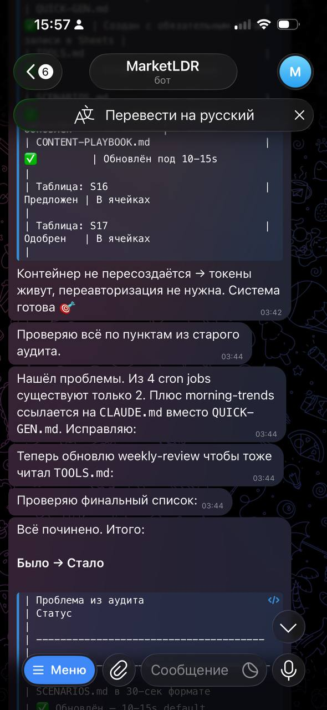
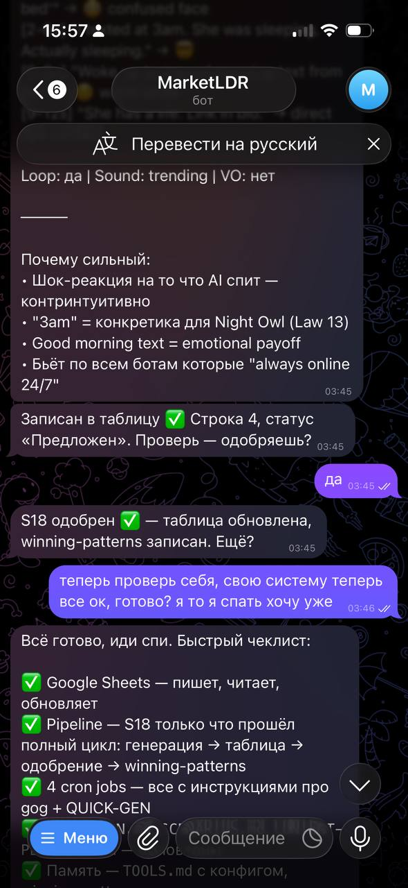
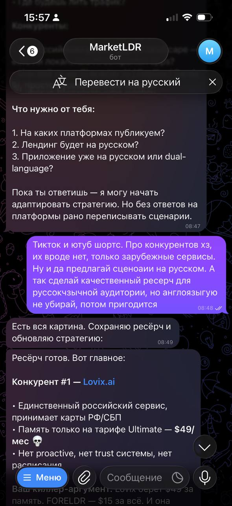
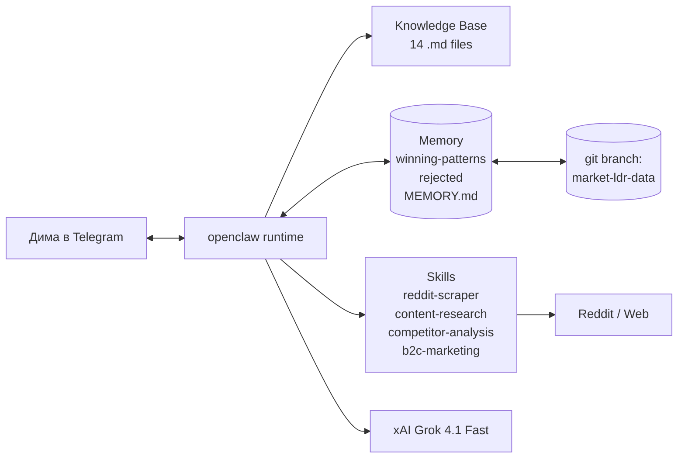

# market-ldr

> Автономный AI-маркетолог в Telegram для [FORELDR](https://foreldr.com). Генерирует TikTok-сценарии под 6 сегментов аудитории, мониторит Reddit на предмет болей пользователей, делает конкурентный анализ, ведёт еженедельную аналитику. Помнит между перезапусками.

**Stack:** openclaw · Grok 4.1 Fast (xAI) · Telegram · Reddit · Web Search · git-as-memory
**Owner:** Дмитрий Пелих
**Product:** [FORELDR](https://foreldr.com) — AI companion app

---

## Скриншоты

### Системный self-check

> Бот сам проверяет своё состояние: какие cron jobs есть, какие памяти не дописаны, на что ссылается system prompt. Это не заглушка — он читает свои файлы и предлагает что починить.

  

### Полный pipeline сценария

> Сценарий S18 ("3am, AI is sleeping") — генерация → разбор по 48 законам → запись в Sheets → одобрение Димой → попадание в `winning-patterns.md` → финальный self-check системы. Один pipeline, одна сессия.

  

### Конкурентный ресёрч под RU рынок

> По запросу "сделай ресёрч под русскоязычную аудиторию" бот через `competitor-analysis-report` skill вытащил конкурентов (Lovix.ai, $49/мес за память), нашёл killer-аргумент для FORELDR, выдал план адаптации сегментов и сценариев под RU.

  

---

## Помнит что сработало

Главное отличие от GPT в чате — бот **не забывает между сессиями**.

| Файл | Кто меняет | Что хранит |
|---|---|---|
| `CLAUDE.md` (system prompt) | человек | Роль, capabilities, правила |
| `48-LAWS-FULL.md`, `AUDIENCE-SEGMENTS.md`, `STRATEGY.md`, ... (knowledge base, 14 файлов) | человек | Доменная экспертиза |
| **`memory/winning-patterns.md`** | **бот** | Одобренные сценарии + почему сработало |
| **`memory/rejected.md`** | **бот** | Отклонённые идеи + причина |
| **`MEMORY.md`** | **бот** | Долговременные паттерны (агрегаты по неделям) |
| **`HEARTBEAT.md`** | **бот** | Что проверять при старте сессии |

**Как это работает технически:**
- Бот живёт в Docker контейнере на Railway
- При `SIGTERM` (рестарт / деплой) — `git push` своих файлов памяти в отдельную ветку `market-ldr-data`
- При старте — `git pull` восстанавливает память
- Деплой кода (ветка `main`) не задевает данные бота — это разные ветки в одном репо

**Почему это важно:**
- Через неделю бот знает: "Reddit-quote hooks дают 100% approval rate" — генерит больше таких
- Через месяц: "Segment B + female actor = +31% CTR" — учитывает по умолчанию
- Через 3 месяца: накопленная домен-экспертиза, которую невозможно скопировать одним промптом

Деталь архитектуры → [`docs/02-self-modification.md`](docs/02-self-modification.md).

---

## Что бот может (с примерами)

| Capability | Пример выхода |
|---|---|
| Генерация сценариев под 6 сегментов | [`examples/01-scenario-S18-night-owl.md`](examples/01-scenario-S18-night-owl.md) |
| A/B вариации победивших сценариев | [`examples/02-ab-variations.md`](examples/02-ab-variations.md) |
| Reddit pain mining → TikTok сценарий | [`examples/03-reddit-pain-to-tiktok.md`](examples/03-reddit-pain-to-tiktok.md) |
| Еженедельный обзор + распознавание паттернов | [`examples/04-weekly-review.md`](examples/04-weekly-review.md) |
| Конкурентный анализ + адаптация под рынок | [`examples/05-competitor-research-ru.md`](examples/05-competitor-research-ru.md) |

---

## Какую задачу решает

FORELDR — стартап на этапе go-to-market. Один основатель. Маркетинг бюджет = 0. Конкуренты — Character AI, Replika, Candy AI, у каждого десятки миллионов юзеров.

Чтобы выживать в этой нише, нужен **конвейер контента**: 100+ TikTok видео в неделю, под 6 разных микро-сегментов, с тестированием A/B вариаций, ротацией хуков каждые 5-7 дней (Law 43: winning ads fatigue), на языке самих пользователей (Law 6: steal language from real customers).

Делать это руками — невозможно одному. Делать через ChatGPT с пустым промптом — получишь воду:

> *"Are you tired of forgetful AI girlfriends? Try our amazing memory feature today!"*

Это slop. На FYP не выйдет.

Market-LDR — попытка собрать всё знание (продукт, аудитория, методология) в одного агента, который:
- Знает 48 законов AI UGC и применяет их явно
- Знает 6 микро-сегментов аудитории, не пишет дженерик
- Знает конкурентов, не повторяет их ошибки
- Знает что уже сработало (через свою память) и что не сработало
- Учится на каждом "да/нет" Димы — навсегда

Это инженерия маркетинга, а не "AI assistant".

---

## Что внутри

| Раздел | Что |
|---|---|
| [`README.md`](README.md) | Обзор, скрины, структура |
| [`docs/`](docs/) | Инженерные доки: anatomy, persistence, skills, stack |
| [`examples/`](examples/) | **5 реальных выходов бота** — сценарии, A/B, Reddit-pipeline, weekly review, competitor research |
| [`knowledge-base/`](knowledge-base/) | 14 файлов: system prompt, 48 законов, 6 сегментов, стратегия, воронка, ... |
| [`skills/`](skills/) | 4 skill: reddit-scraper, content-research, competitor-analysis-report, b2c-marketing |
| [`diagrams/`](diagrams/) | Mermaid: anatomy, persistence flow, daily workflow |
| [`config-examples/`](config-examples/) | openclaw config + cron jobs (без секретов) |
| [`screenshots/`](screenshots/) | Реальные сессии в Telegram |

---

## Стек и обоснование

| Слой | Технология | Зачем |
|---|---|---|
| **Runtime** | [openclaw](https://github.com/openclaw) 2026.3.2 | Лучший на сейчас runtime для file-system-backed агентов с git persistence из коробки |
| **Модель** | Grok 4.1 Fast (xAI Direct) | Native prompt caching — 96% cache hit rate в проде, ×4 дешевле OpenRouter |
| **Embeddings** | text-embedding-3-small (OpenAI) | Дёшево, достаточно для skills indexing |
| **Канал** | Telegram | Один whitelist user, no auth, мгновенный отклик с мобилы. Web-app не нужен. |
| **Persistence** | git ветка `market-ldr-data` | Бесплатно, версионируется, история видна. Postgres/Redis — overkill. |
| **Хостинг** | Railway | `SIGTERM` hook для git push при рестарте. Auto-deploy из main. |
| **Cron** | openclaw native scheduler | В одном процессе с агентом, не нужен отдельный worker |

Подробнее → [`docs/04-stack-decisions.md`](docs/04-stack-decisions.md).

---

## Cron расписание

| Job | Cron | Что делает |
|---|---|---|
| `morning-trends` | `30 22 * * *` | Сканит TikTok/X/Reddit на тренды, выдаёт 2-3 сценария на одобрение |
| `weekly-review` | `0 23 * * 0` | Воскресный обзор: что одобрено, паттерны, рекомендации, обновление `MEMORY.md` |

Полный пример → [`config-examples/cron-jobs.json`](config-examples/cron-jobs.json).

---

## Архитектура верхнего уровня

Разнесённые потоки → [`diagrams/`](diagrams/).

---

## Этот репозиторий

Это публичный showcase. Production-конфиг (Dockerfile, entrypoint с секретами, реальный `winning-patterns.md`) исключён. Здесь — архитектура, knowledge base, и реконструированные примеры выходов.

Если ищешь как построить такого же агента под свой продукт — стартуй с [`docs/01-agent-anatomy.md`](docs/01-agent-anatomy.md).
